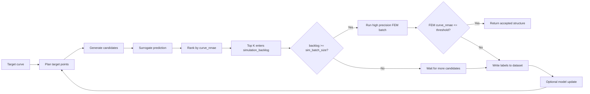

# Closed Loop Pipeline

Source: `src/Scheduler/closed_loop.py`

Current scheduler:

```python
DeterministicSurrogateScheduler = DeterministicSurrogateClosedLoopSystem
```

## Core Idea

The loop optimizes for throughput:

```text
target curve
-> target planning
-> inverse candidate generation
-> fast surrogate ranking
-> Top K candidate backlog
-> full-batch high precision FEM
-> dataset update
-> next iteration
```

The surrogate does not decide final success. It only ranks candidates and fills
the FEM backlog. Final success is decided only by high precision FEM.

## Current Flow



## Candidate Selection for FEM

1. `ForwardSurrogate` predicts a stress curve for every generated candidate.
2. The scheduler computes `curve_nmae` against the final target.
3. Candidates are sorted by `curve_nmae`, ascending.
4. The best `surrogate_top_k` candidates enter `simulation_backlog`.
5. FEM runs only when `len(simulation_backlog) >= sim_batch_size`.
6. Surrogate accepted status is only logged. It does not affect scheduling.

## Meaning of Accepted

There are two accepted signals:

```text
surrogate accepted
    curve_nmae <= acceptance_curve_nmae on surrogate prediction
    meaning: useful priority signal only

FEM accepted
    curve_nmae <= acceptance_curve_nmae on high precision simulation
    meaning: final success
```

Current throughput policy:

```text
surrogate accepted does not trigger immediate FEM.
FEM waits until the backlog reaches sim_batch_size.
```

## Training Triggers

There are three independent triggers:

```text
CPU FEM
    trigger: len(simulation_backlog) >= sim_batch_size
    cold-start default: sim_batch_size = 24
    action: run one full high precision FEM batch

GPU Forward FEM Network
    trigger: new forward simulation truth rows >= min_forward_update_rows
    cold-start default: min_forward_update_rows = 128
    data: HighPrecisionFEM simulation rows only
    action: forward_surrogate.finetune(rows)

GPU Inverse Designer
    trigger: weighted new inverse rows >= min_inverse_update_rows
    cold-start default: min_inverse_update_rows = 64
    data: surrogate rows + simulation rows
    weight: surrogate rows are weak labels; simulation rows are strong labels
    action: inverse_designer.finetune(rows)
```

Default inverse weights are managed by `DatasetManager`:

```text
surrogate inverse label weight = 0.25
simulation inverse label weight = 1.0
```
