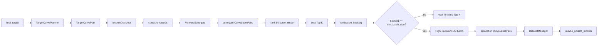
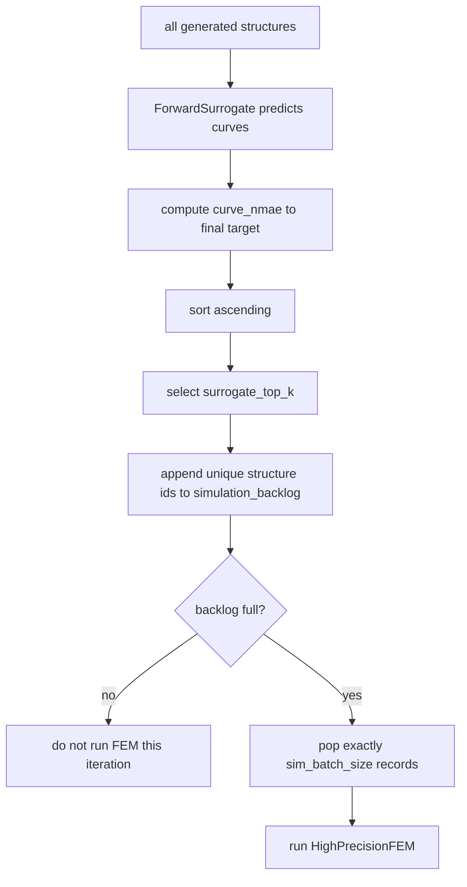
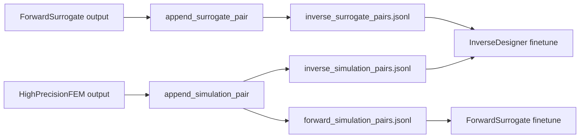
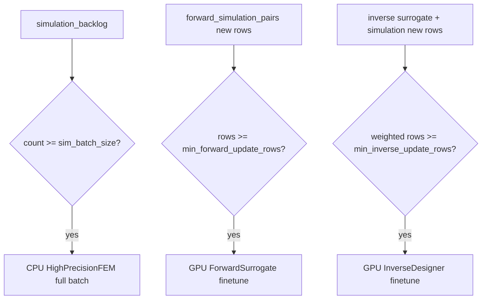
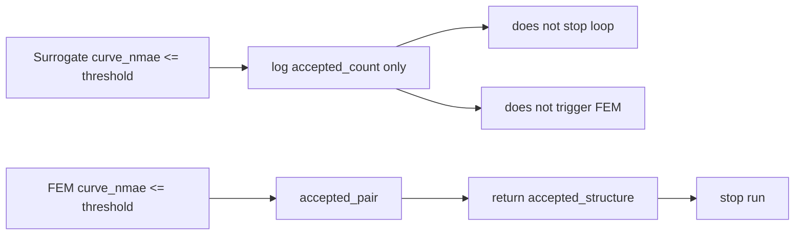

# Deterministic Surrogate Closed Loop Context

This document is the working context for the active closed-loop inverse-design
system. It is intentionally centered on:

```text
src/Scheduler/closed_loop.py
DeterministicSurrogateClosedLoopSystem
```

The legacy `StructureDiscoverySystem` and the agentic KnowledgeBase stack are
not the target online path.

## 1. Active Scheduler

The active scheduler alias is:

```python
DeterministicSurrogateScheduler = DeterministicSurrogateClosedLoopSystem
```

The closed loop is deterministic and throughput-oriented:

```text
target curve
-> target planning
-> inverse candidate generation
-> fast surrogate ranking
-> Top K simulation backlog
-> full-batch high precision FEM
-> dataset update
-> threshold-triggered GPU finetune
-> next iteration
```

Core modules:

```text
TargetCurvePlanner
    final target curve -> planned target curves

InverseDesigner
    planned target curves -> explicit structures

ForwardSurrogate
    explicit structures -> fast approximate stress curves

HighPrecisionFEM
    selected structures -> high-trust simulation stress curves

DatasetManager
    stores labels, tracks training cursors, triggers model updates
```

### Detail Subgraphs

#### One-Iteration Data Path



#### FEM Backlog Selection



Key boundary:

```text
surrogate accepted status is not a scheduling trigger.
Only Top K membership decides backlog entry.
Only backlog fullness decides FEM execution.
```

#### Dataset Ledgers



#### Three Compute Triggers



#### Acceptance Boundary



## 2. Default Cold-Start Policy

Current cold-start defaults:

```python
DeterministicLoopConfig(
    finetune_policy="threshold",
    sim_batch_size=24,
    surrogate_top_k=6,
    min_forward_update_rows=128,
    min_inverse_update_rows=64,
    acceptance_curve_nmae=0.05,
)
```

Meaning:

```text
CPU FEM runs only at full batch.
GPU forward network finetunes after enough new FEM truth.
GPU inverse designer finetunes after enough weighted inverse labels.
Final success is decided only by high precision FEM.
```

## 3. One Iteration

`run()` repeatedly calls `run_iteration()` until either:

```text
1. a high precision FEM pair is accepted, or
2. max_iterations is reached.
```

`run_iteration()` performs the following steps.

### Step 1: Normalize Target

The input `final_target` is normalized once and used as the reference target for
surrogate ranking and FEM acceptance.

```text
target = normalize_target_property(final_target)
```

### Step 2: Plan Target Curves

`TargetCurvePlanner.plan()` creates a target plan using:

```text
target_batch_size
samples_per_target
iteration
```

The scheduler then forces the exact final target into the plan if the planner
omitted it. This keeps the final objective present in every iteration.

### Step 3: Generate Candidate Structures

`InverseDesigner` is called in one of two modes:

```text
preferred:
    inverse_designer.sample_schedule(schedule)

fallback:
    inverse_designer.sample_structure(item.target_property)
```

Every returned structure is normalized with:

```text
original_structure_id
unique structure_id
target_plan
scheduled_target
final_target
```

The unique `structure_id` is what the simulation backlog uses for de-duplication.

### Step 4: Fast Surrogate Prediction

`ForwardSurrogate` predicts a stress curve for every generated structure:

```text
preferred:
    forward_surrogate.predict_many(...)

fallback:
    forward_surrogate.predict(...)
```

Each surrogate prediction is stored as a `CurveLabelPair` through:

```text
DatasetManager.append_surrogate_pair()
```

This writes to:

```text
inverse_surrogate_pairs.jsonl
```

Surrogate labels are weak labels for `InverseDesigner`. They are not truth for
`ForwardSurrogate`, and they never decide final success.

### Step 5: Rank Candidates

For every surrogate pair, the scheduler computes:

```text
curve_nmae = stress_curve_error_metrics(final_target, surrogate_curve)
```

Then it sorts candidates by `curve_nmae`, ascending.

The best `surrogate_top_k` structures are selected:

```text
top_k_surrogate = ranked_surrogate[:surrogate_top_k]
top_k_ids = structure ids from top_k_surrogate
```

Only these `top_k_ids` enter `simulation_backlog`.

Important:

```text
surrogate accepted status is logged only.
surrogate accepted does not trigger immediate FEM.
surrogate accepted does not create a separate scheduling path.
```

First-principles rule:

```text
surrogate ranks candidates
Top K fills the FEM backlog
batch fullness triggers FEM
```

### Step 6: Fill FEM Backlog

`_append_simulation_backlog()` appends only structures whose id is in `top_k_ids`
and not already queued.

Each queued record preserves why it was selected:

```text
selection_reason = "surrogate_top_k"
surrogate_acceptance = ranking and error metadata
```

### Step 7: Run High Precision FEM Only When Full

High precision FEM is triggered only when:

```text
len(simulation_backlog) >= sim_batch_size
```

If the backlog is not full:

```text
simulation_records = []
simulation_pairs = []
```

If the backlog is full, the scheduler pops exactly one batch:

```text
min_count = sim_batch_size
max_count = sim_batch_size
```

Then it calls:

```text
preferred:
    high_precision_fem.simulate_many(...)

fallback:
    high_precision_fem.simulate(...)
```

Each FEM result is stored through:

```text
DatasetManager.append_simulation_pair()
```

This writes the same high-trust pair to:

```text
inverse_simulation_pairs.jsonl
forward_simulation_pairs.jsonl
```

## 4. Three Compute Triggers

The system has three high-density compute triggers. They are deliberately
separate.

### Trigger A: CPU HighPrecisionFEM

Condition:

```text
len(simulation_backlog) >= sim_batch_size
```

Default:

```text
sim_batch_size = 24
```

Data source:

```text
surrogate-ranked Top K candidates accumulated in simulation_backlog
```

Action:

```text
run a full HighPrecisionFEM batch
```

This trigger optimizes CPU throughput. It is not affected by surrogate accepted
status.

### Trigger B: GPU Forward FEM Network

Condition:

```text
new_forward_simulation_rows >= min_forward_update_rows
```

Default:

```text
min_forward_update_rows = 128
```

Data source:

```text
forward_simulation_pairs.jsonl
```

Training rows:

```text
structure -> high precision FEM stress curve
```

Action:

```text
forward_surrogate.finetune(rows)
```

ForwardSurrogate must train only on HighPrecisionFEM truth. It must not train on
its own surrogate predictions.

### Trigger C: GPU Inverse Designer

Condition:

```text
weighted_new_inverse_rows >= min_inverse_update_rows
```

Default:

```text
min_inverse_update_rows = 64
```

Data sources:

```text
inverse_surrogate_pairs.jsonl
inverse_simulation_pairs.jsonl
```

Training rows:

```text
surrogate stress curve -> structure
simulation stress curve -> structure
```

Default weights:

```text
surrogate inverse label weight = 0.25
simulation inverse label weight = 1.0
```

Action:

```text
inverse_designer.finetune(rows)
```

Rationale:

```text
ForwardSurrogate is expected to approach HighPrecisionFEM over time.
Therefore surrogate labels are useful weak supervision for InverseDesigner.
Simulation labels remain stronger supervision.
```

## 5. Dataset Semantics

`DatasetManager` owns the label ledgers and training cursors.

### Surrogate Pair

Created by:

```text
process_fast_queue()
```

Stored by:

```text
append_surrogate_pair()
```

Destination:

```text
inverse_surrogate_pairs.jsonl
```

Consumers:

```text
InverseDesigner only
```

Default weight:

```text
0.25
```

### Simulation Pair

Created by:

```text
process_slow_queue()
```

Stored by:

```text
append_simulation_pair()
```

Destinations:

```text
inverse_simulation_pairs.jsonl
forward_simulation_pairs.jsonl
```

Consumers:

```text
InverseDesigner
ForwardSurrogate
```

Default inverse weight:

```text
1.0
```

### Training Cursors

DatasetManager maintains separate cursors:

```text
_inverse_train_cursor
_forward_train_cursor
```

During `update_models()`:

```text
pending_inverse_rows = new inverse rows since last inverse update
pending_forward_rows = new forward rows since last forward update
```

The inverse cursor advances only after inverse finetune runs. The forward cursor
advances only after forward finetune runs.

## 6. Model Update Path

`run_iteration()` ends with:

```text
maybe_update_models()
```

If:

```text
finetune_policy not in {"auto", "threshold"}
```

then no model update is attempted.

With the cold-start default:

```text
finetune_policy = "threshold"
```

the scheduler calls:

```text
DatasetManager.update_models(
    inverse_designer=inverse_designer,
    forward_surrogate=forward_surrogate,
    min_inverse_rows=min_inverse_update_rows,
    min_forward_rows=min_forward_update_rows,
)
```

Update behavior:

```text
InverseDesigner:
    select new inverse rows
    sum row weights
    if weighted sum >= min_inverse_update_rows:
        inverse_designer.finetune(rows)

ForwardSurrogate:
    select new forward simulation rows
    if row count >= min_forward_update_rows:
        forward_surrogate.finetune(rows)
```

Current update calls are synchronous function calls. Remote adapters may submit
remote GPU jobs internally, but the scheduler-level policy is threshold based.

## 7. Acceptance Rule

Both surrogate predictions and FEM simulations can produce an `accepted` flag
from the same helper:

```text
accepted = curve_nmae <= acceptance_curve_nmae
```

Default:

```text
acceptance_curve_nmae = 0.05
```

But their meanings are different:

```text
surrogate accepted:
    log and diagnostic signal only
    does not trigger immediate FEM
    does not stop the loop

FEM accepted:
    final success condition
    stops run()
    returns accepted_structure and accepted_pair
```

The loop stops only when HighPrecisionFEM validates a candidate.

## 8. Queue Policy

Current implementation:

```text
queue_policy = "serial_queues"
```

This means one `run_iteration()` executes logical queues in serial order:

```text
plan -> inverse -> surrogate -> backlog -> maybe FEM -> maybe finetune
```

The design is compatible with future async workers, but current semantics should
not assume a daemon or concurrent scheduler.

## 9. What Is Not In The Active Loop

The following legacy modules are not part of the active online decision loop:

```text
AgentExplorer
KnowledgeBase
KnowledgeRefiner
FeedbackSignalExtractor
RawExperimentStore as online memory
```

They may still exist for legacy workflows, reports, or compatibility, but new
closed-loop behavior should be expressed through:

```text
TargetCurvePlanner
InverseDesigner
ForwardSurrogate
HighPrecisionFEM
DatasetManager
DeterministicSurrogateClosedLoopSystem
```

## 10. First-Principles Summary

The closed loop is built around three simple rules:

```text
1. Use ForwardSurrogate to rank many candidates cheaply.
2. Spend HighPrecisionFEM only on accumulated Top K full batches.
3. Improve GPU models only when enough new training signal exists.
```

The final success boundary is deliberately strict:

```text
Only HighPrecisionFEM accepted means solved.
```
