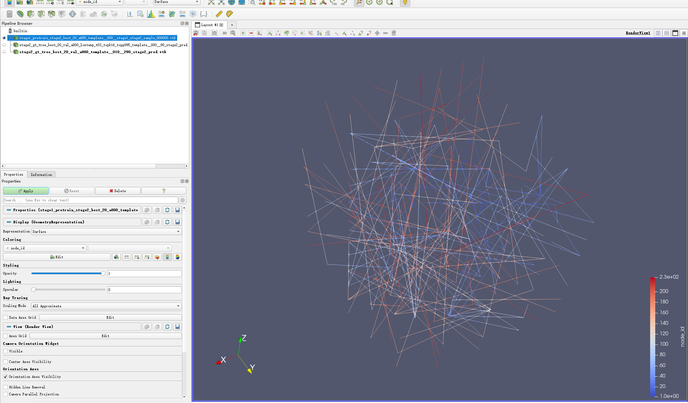
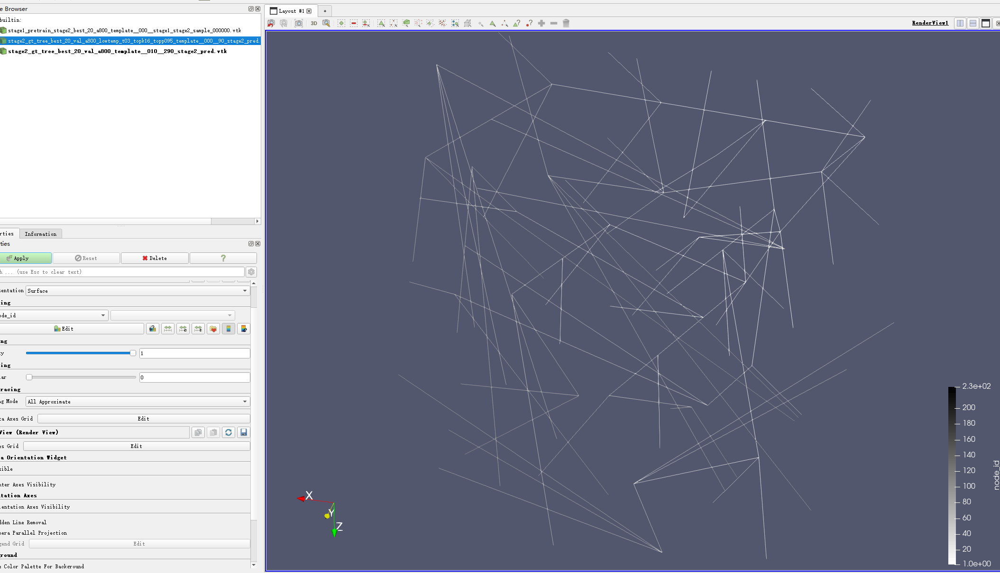
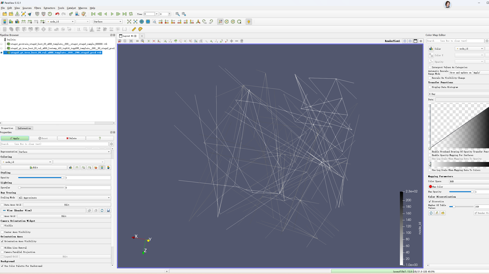

# Truss Inverse Designer

本文给出一个三阶段的 truss 逆向生成方案。核心顺序为：

```text
Stage 1: Spanning Tree Predictor
  -> Stage 2: Auto-regressive Coordinate Predictor
  -> Stage 3: Extra-edge Predictor
```

即先生成连通骨架，再生成节点坐标，最后基于拓扑和几何信息补充额外边。

---

## 1. 核心目标

给定目标性质 $y$，生成 truss structure：

$$
S=(T,X).
$$

其中拓扑为：

$$
T=(n,E),
$$

节点坐标为：

$$
X=\{x_1,x_2,\dots,x_n\},\qquad x_i\in \mathbb{R}^3.
$$

生成结果需要满足：

1. 图是 simple graph，没有 self-loop 和重复边；
2. 图是 connected graph；
3. 节点坐标和边连接在几何上合理；
4. 最终结构能够匹配目标性质 $y$。

原生成顺序为：

```text
tree -> extra edges -> coordinates
```

本文采用新的顺序：

```text
tree -> coordinates -> extra edges
```

这样可以先得到连通骨架和空间布局，再让 extra-edge predictor 根据几何关系补边。

---

## 2. 总体分解

直接生成完整 truss 较难，因为模型需要同时决定节点数量、连接关系、节点坐标和目标性能。这里将问题拆成三步：

```text
Stage 1: generate a connected skeleton
Stage 2: generate coordinates on the skeleton
Stage 3: complete the graph using geometry-aware edge prediction
```

对应概率分解为：

$$
P(S\mid y)
=P(n,P\mid y)\,
P(X\mid G_{\mathrm{tree}},y)\,
P(k,E_{\mathrm{extra}}\mid G_{\mathrm{tree}},X,y).
$$

其中：

- $P=[p_2,\dots,p_n]$：parent-pointer sequence；
- $G_{\mathrm{tree}}=(V,E_{\mathrm{tree}})$：Stage 1 生成的 spanning tree；
- $X$：Stage 2 生成的节点坐标；
- $k$：Stage 3 预测的 extra-edge 数量；
- $E_{\mathrm{extra}}$：Stage 3 预测的补充边。

最终边集合为：

$$
E=E_{\mathrm{tree}}\cup E_{\mathrm{extra}}.
$$

这个分解的优点是：

```text
Stage 1 guarantees connectivity.
Stage 2 gives the graph a spatial layout.
Stage 3 uses geometry to decide which extra edges are meaningful.
```

---

## 3. Stage 1: Spanning Tree Predictor

Stage 1 生成一个 guaranteed connected skeleton。节点按顺序生成：

$$
1,2,\dots,n.
$$

节点 $1$ 作为 root。对于每个新节点 $i$，模型预测它的 parent：

$$
p_i\in \{1,\dots,i-1\}.
$$

然后加入 tree edge：

$$
(i,p_i).
$$

因此 tree edges 为：

$$
E_{\mathrm{tree}}
=\{(i,p_i)\mid i=2,\dots,n\}.
$$

由于每个新节点都连接到已有节点，Stage 1 的输出天然连通。它解决的是 graph validity 问题：

```text
no isolated nodes
no disconnected components
valid connected base graph
```

这一步避免了直接预测完整 adjacency matrix 时常见的 disconnected graph。



*Figure 1. Stage 1/2 生成结果的 ParaView 叠加视图，用于对比不同样本或不同阶段的 truss 线框结构。*

---

## 4. Stage 2: Auto-regressive Coordinate Predictor

Stage 2 在 tree skeleton 上生成节点坐标。输入为：

$$
G_{\mathrm{tree}},\ y,
$$

输出为：

$$
X=\{x_1,\dots,x_n\}.
$$

这里不使用完整 topology 作为条件，因为 extra edges 尚未生成。模型只根据 spanning tree 和目标性质 $y$ 生成坐标。

可以将 tree 序列化为 prefix：

$$
S_{\mathrm{tree}}
=
[\langle N\rangle,n,
\langle TREE\rangle,p_2,\dots,p_n,
\langle COORD\rangle].
$$

然后自回归生成 coordinate tokens：

$$
S_X=
[q_1^x,q_1^y,q_1^z,\dots,q_n^x,q_n^y,q_n^z].
$$

对应概率为：

$$
P(X\mid G_{\mathrm{tree}},y)
=
\prod_{q_t\in S_X}
P(q_t\mid S_{\mathrm{tree}},y,q_{<t}).
$$

坐标可继续使用 quantization：

$$
q_i^a=\operatorname{round}(1023x_i^a),
\qquad a\in\{x,y,z\}.
$$

反量化为：

$$
\hat{x}_i^a=\frac{q_i^a}{1023}.
$$

Stage 2 的作用是把抽象 tree skeleton 转成 spatial structure。Stage 1 只知道哪些节点相连，Stage 2 给每个节点分配坐标，使后续补边能利用几何信息。



*Figure 2. Stage 2 预测得到的 tree skeleton 示例 000，展示坐标生成后的空间线框布局。*



*Figure 3. Stage 2 预测得到的 tree skeleton 示例 010，用于展示不同目标或不同样本下的空间布局差异。*

---

## 5. 为什么先生成坐标再补边

新的顺序为：

```text
tree -> coordinates -> extra edges
```

extra edge 的合理性通常依赖几何关系。如果先补边再生成坐标，Extra-edge Predictor 只能根据 tree topology 判断节点是否应连接，无法判断：

```text
两个节点空间距离是否太远
strut 是否几何上合理
局部结构是否已经足够密集
补边是否会改善结构刚度
```

先生成坐标后，Stage 3 可以同时利用：

```text
tree topology
node coordinates
target property
candidate edge geometry
```

因此 extra-edge prediction 可以建模为 geometry-aware graph completion。

---

## 6. Stage 3: Extra-edge Predictor

Stage 3 从 spanning tree 出发，根据坐标补充 extra edges，得到最终 truss topology。

候选边集合为：

$$
\mathcal{C}
=\{(i,j)\mid 1\le i<j\le n,\ (i,j)\notin E_{\mathrm{tree}}\}.
$$

该定义自动排除 self-loop、重复无向边和已有 tree edges。

Stage 3 包含两个子模块：

```text
Edge-Budget Predictor: decide how many extra edges to add.
Extra-Edge Scorer: decide which candidate edges are best.
```

Edge-Budget Predictor 预测补边数量：

$$
k.
$$

Extra-Edge Scorer 给每条候选边打分：

$$
s_{ij}=\operatorname{MLP}_e(\phi_{ij}).
$$

其中 edge feature 为：

$$
\phi_{ij}
=
[h_i,h_j,x_i,x_j,\lVert x_i-x_j\rVert,c_y,\operatorname{emb}(k)].
$$

这里：

- $h_i,h_j$：tree encoder 得到的节点表示；
- $x_i,x_j$：Stage 2 生成的节点坐标；
- $\lVert x_i-x_j\rVert$：候选边长度；
- $c_y$：目标性质编码；
- $\operatorname{emb}(k)$：补边预算信息。

最后用 TopK 选择分数最高的 $k$ 条边：

$$
E_{\mathrm{extra}}
=
\operatorname{TopK}_{(i,j)\in\mathcal{C}}(s_{ij},k).
$$

最终 topology 为：

$$
E=E_{\mathrm{tree}}\cup E_{\mathrm{extra}}.
$$

---

## 7. Stage 3 的算法本质

Stage 3 不是重新生成完整图，而是在已有 connected tree 上做 constrained graph completion。更具体地说，它是：

```text
geometry-aware and budget-constrained link prediction
```

它有三个约束：

1. 只能从合法候选边集合 $\mathcal{C}$ 中选边；
2. 不能选择已经存在的 tree edge；
3. 最终必须选出 exactly $k$ 条 extra edges。

因此，Stage 3 的任务不是判断任意节点对是否成边，而是在固定候选集合中选择最合理的 $k$ 条边。

---

## 8. 推理流程

完整推理过程如下：

```text
Input:
    target property y

1. Encode target property:
       c_y = MLP_y(y)

2. Predict or set node count:
       n ~ P(n | y)
       or n = N

3. Generate spanning tree:
       for i = 2 to n:
           predict parent p_i from {1, ..., i-1}
           add edge (i, p_i)

       output:
           G_tree = (V, E_tree)

4. Generate coordinates:
       serialize G_tree into tree prefix
       autoregressively generate coordinate tokens
       dequantize tokens into X

5. Predict extra-edge budget:
       k ~ P(k | G_tree, X, y)

6. Build candidate edge set:
       C = {(i, j): i < j and (i, j) not in E_tree}

7. Score candidate edges:
       s_ij = MLP_e([topology feature, geometry feature, y, k])

8. Select extra edges:
       E_extra = TopK(C, s, k)

9. Output final truss:
       E = E_tree union E_extra
       S = (T, X)
```

---

## 9. Training Loss

整体 loss 为：

$$
\mathcal{L}
=
\lambda_t\mathcal{L}_{\mathrm{tree}}
+
\lambda_x\mathcal{L}_{\mathrm{coord}}
+
\lambda_k\mathcal{L}_k
+
\lambda_e\mathcal{L}_{\mathrm{extra}}.
$$

其中：

- $\mathcal{L}_{\mathrm{tree}}$：训练 parent-pointer generation；
- $\mathcal{L}_{\mathrm{coord}}$：训练 coordinate token generation；
- $\mathcal{L}_k$：训练 extra-edge 数量预测；
- $\mathcal{L}_{\mathrm{extra}}$：训练 candidate edge scoring。

由于候选边中负样本通常远多于正样本，$\mathcal{L}_{\mathrm{extra}}$ 建议使用 weighted BCE：

$$
\mathcal{L}_{\mathrm{extra}}
=
-
\sum_{(i,j)\in\mathcal{C}}
\left[
w_{\mathrm{pos}}z_{ij}\log\sigma(s_{ij})
+
w_{\mathrm{neg}}(1-z_{ij})\log(1-\sigma(s_{ij}))
\right].
$$

训练 Stage 3 时可以先使用 ground-truth coordinates，使 edge scorer 在真实几何条件下学习补边；推理时再替换为 Stage 2 生成的 coordinates。
